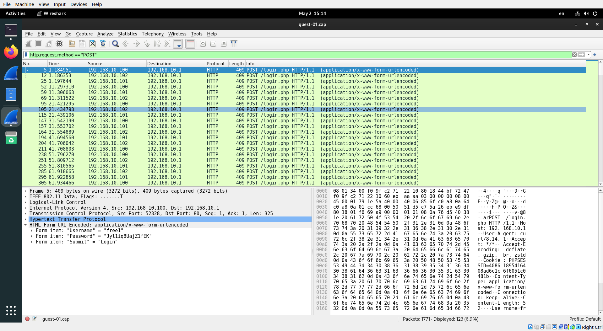
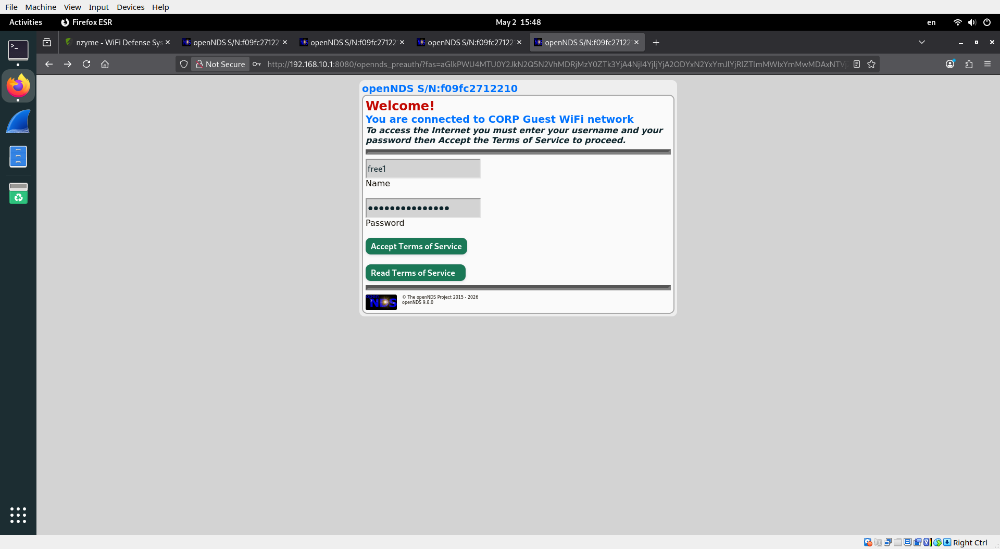

# h6 WiFi

## Laitteisto:
```
- Käyttöjärjestelmä: Linux Mint 22.2 (Zara), pohjautuu Ubuntu 24.04 LTS
- Kernel: Linux 6.14.0-37-generic (x86_64)

- Suoritin: AMD Ryzen 7 1700 (8 ydintä / 16 säiettä)
- Keskusmuisti: 16 GB RAM

- Näytönohjain: NVIDIA GeForce GTX 1070 (NVIDIA-ajuri 535.288.01)
- Työpöytäympäristö: Cinnamon 6.4.8 (X11)

- Tallennustila:
  - Samsung SSD 860 EVO 500 GB
  - Seagate HDD 2 TB
```

Aku Ihamuotila

---

## a)

Latasin WiFi Challenge lab virtuaalikoneen ja asensin ja avasin sen virtualboxin avulla.

Vaihdon näppäimistön kieleksi suomen virtuaalikoneella komennolla `setxkbmap fi`

**00. What is the contents of the file /root/flag.txt on the VM?**

```bash
$ sudo cat /root/flag.txt
flag{2162ae75cdefc5f731dfed4efa8b92743d1fb556}
```

**01. What is the channel that the wifi-global Access Point is currently using?**

Käytin komentoa `ip link show` näyttämään virtuaalikoneen kaikki verkkorajapinnat

Asetan komennolla `sudo airmon-ng start wlan0` wlan0 rajapinnan monitorointitilaan.

Tästä syntyy monitorointirajapinta nimeltä `wlan0mon`

Normaalitilassa wifi-kortti vain etsii ja liittyy verkkoon ja käyttää vain itselleen kuuluvaa liikennettä.

Monitorointitilassa se toimii niinkuin kuuntelulaite. Se ei siis yritä liittyä verkkoon vaan kuuntelee mitä langattomassa ympäristössä tapahtuu. Monitorointitilassa voidaan nähdä esim. mitä WiFi verkkoja lähistöllä on, millä kanavalla ne toimivat, millainen salaus niissä on, onko verkkoon liittynyt laitteita jne.

lopuksi käytin komentoa `sudo airodump-ng --band a wlan0mon` se aloittaa kuuntelun ja kuuntelee 5 Ghz WiFi-verkkoja juuri tekemäni monitorointirajapinnan avulla.

```bash
$ sudo airodump-ng --band a wlan0mon


 CH 112 ][ Elapsed: 36 s ][ 2026-05-02 14:28 

 BSSID              PWR  Beacons    #Data, #/s  CH   MB   ENC CIPHER  AUTH ESSID

 F0:9F:C2:7A:33:28  -25       19        9    0  44   54e  WPA2 CCMP   MGT  wifi-regional-tablets                                                                                                          
 F0:9F:C2:71:22:15  -25       19        0    0  44   54e  WPA2 CCMP   MGT  wifi-corp                                                                                                                      
 F0:9F:CB:3F:BC:27  -25       20        0    0  44   54   WPA2 CCMP   MGT  wifi-corp-legacy                                                                                                               
 F0:9F:C2:71:AF:2F  -25       20       43    0  44   54   WPA3 CCMP   OWE  wifi-gratis                                                                                                                    
 F0:9F:C2:71:22:17  -25       20       60    0  44   54e  WPA2 CCMP   MGT  wifi-global                                                                                                                    
 F0:9F:C2:71:22:16  -25       20        0    0  44   54e  WPA2 CCMP   MGT  wifi-regional                                                                                                                  
 F0:9F:C2:71:22:1A  -25       20        0    0  44   54e  WPA2 CCMP   MGT  wifi-corp                                                                                                                      

 BSSID              STATION            PWR    Rate    Lost   Frames  Notes  Probes

 F0:9F:C2:7A:33:28  64:32:A8:A9:DE:55  -26   48e-54e     0        8                                                                                                                                        
 F0:9F:C2:71:AF:2F  64:32:A8:FA:21:F4  -26   54 -54      0       42                                                                                                                                        
 F0:9F:C2:71:22:17  64:32:A8:BC:53:51  -26   54e-54e     0        8         open-wifi,home-WiFi,WiFi-Restaurant                                                                                            
 F0:9F:C2:71:22:17  64:32:A8:BA:18:42  -26   54e- 1e   128       55                                                                                                                                        
 (not associated)   64:32:A8:BA:6C:41  -26    0 - 6      0        6         wifi-corp                                                                                                                      
 (not associated)   9A:A3:16:BD:7D:5B  -49    0 - 6     23        5                                                                                                                                        
 (not associated)   62:C7:2D:7C:BB:CD  -49    0 - 6     20        5                                                                                                                                        
 (not associated)   AE:4A:17:E3:E0:B0  -49    0 - 6     20        5                                                                                                                                        
 (not associated)   AA:53:C8:EB:51:12  -49    0 - 1      0        2                                                                                                                                        
 (not associated)   CA:06:52:26:53:A4  -49    0 - 1      0        3                                                                                                                                        
 (not associated)   F0:9F:C2:71:22:16  -49    0 - 6      0       12         wifi-regional                                                                                                                  
 (not associated)   64:32:A8:AD:AB:53  -26    0 - 6    150        8         wifi-corp-legacy                                                                                                               
 (not associated)   B4:99:BA:6F:F9:45  -49    0 - 1      0       21         wifi-offices,Jason                                                                                                             
 (not associated)   78:C1:A7:BF:72:46  -49    0 - 1      0       21         wifi-offices,Jason                                                                                                             
Quitting...
```

Tulosteen riviltä ` F0:9F:C2:71:22:17  -25       20       60    0  44   54e  WPA2 CCMP   MGT  wifi-global` selviää wifi-globalin käyttämä kanava 44.

**02. What is the MAC of the wifi-IT client?**

```bash
$ sudo airodump-ng --band bg wlan0mon

 CH  6 ][ Elapsed: 30 s ][ 2026-05-02 14:47 

 BSSID              PWR  Beacons    #Data, #/s  CH   MB   ENC CIPHER  AUTH ESSID

 BE:33:04:51:26:E6  -28       21        0    0   6   54   WPA2 CCMP   PSK  MiFibra-5-D6G3                                                                                                                 
 F0:9F:C2:71:22:12  -28       21        0    0   6   54   WPA2 CCMP   PSK  wifi-mobile                                                                                                                    
 F0:9F:C2:71:22:10  -28       21        5    0   6   54   OPN              wifi-guest                                                                                                                     
 F0:9F:C2:11:0A:24  -28       23        0    0  11   54e  WPA3 CCMP   SAE  wifi-management                                                                                                                
 56:98:D1:CA:B3:26  -28       23        0    0  11   54   WPA2 CCMP   PSK  WIFI-JUAN                                                                                                                      
 F0:9F:C2:6A:88:26  -28       23        0    0  11   54   OPN              <length:  9>                                                                                                                   
 F0:9F:C2:1A:CA:25  -28       23       11    0  11   54e  WPA3 CCMP   SAE  wifi-IT                                                                                                                        
 4E:DF:77:ED:35:14  -28       21        0    0   9   54   WPA2 CCMP   PSK  vodafone7123                                                                                                                   
 F6:32:9C:9E:2D:AA  -28       45        0    0   3   54   WPA2 CCMP   PSK  MOVISTAR_JYG2                                                                                                                  
 F0:9F:C2:71:22:11  -28       45      835   36   3   54   WEP  WEP         wifi-old                                                                                                                       
 F0:9F:C2:71:22:13  -28       22        0    0   8   54   WPA2 CCMP   PSK  wifi-event                                                                                                                     

 BSSID              STATION            PWR    Rate    Lost   Frames  Notes  Probes

 F0:9F:C2:71:22:10  B0:72:BF:B0:78:48  -29   54 -54      0        3                                                                                                                                        
 F0:9F:C2:71:22:10  B0:72:BF:44:B0:49  -29   54 -54      0        2                                                                                                                                        
 F0:9F:C2:1A:CA:25  10:F9:6F:AC:53:52  -29   54e-54e    20       11                                                                                                                                        
 F0:9F:C2:71:22:11  64:32:A8:56:32:56  -29   54 -54    843      830                                                                                                                                        
 (not associated)   64:32:A8:BA:18:42  -26    0 - 1      8        3                                                                                                                                        
 (not associated)   CA:A4:60:E7:5C:50  -49    0 - 1      1        2                                                                                                                                        
 (not associated)   EE:04:2E:3E:3E:46  -49    0 - 1      1        2                                                                                                                                        
 (not associated)   BE:75:30:C3:6A:E1  -49    0 - 1      6        2                                                                                                                                        
 (not associated)   64:32:A8:BC:53:51  -26    0 - 1     36       12         open-wifi,home-WiFi,WiFi-Restaurant                                                                                            
 (not associated)   3E:C6:D7:42:EE:F1  -49    0 - 1      9        2                                                                                                                                        
 (not associated)   64:32:A8:AD:AB:53  -26    0 - 1    196       18         wifi-corp-legacy                                                                                                               
 (not associated)   E2:F1:93:05:D7:17  -49    0 - 1      0        3                                                                                                                                        
 (not associated)   78:C1:A7:BF:72:46  -49    0 - 1      0       21         wifi-offices,Jason                                                                                                             
 (not associated)   B4:99:BA:6F:F9:45  -49    0 - 1      0       15         wifi-offices,Jason                                                                                                             
 (not associated)   F0:9F:C2:71:22:16  -49    0 - 1      0        6         wifi-regional                                                                                                                  
Quitting...
```

STATION-kohdasta löytyy verkkoon liittyneen clientin MAC kun katsoo kohtaa jossa matchaava BSSID.

`10:F9:6F:AC:53:52`

**03. What is the probe of 78:C1:A7:BF:72:46?**

Löytyy tehtävän 01 airodump tulosteesta -> `wifi-offices`

**06. What is the flag on the AP router of the wifi-guest network?**

```bash
$ sudo airodump-ng -c 6 --bssid F0:9F:C2:71:22:10 -w guest wlan0mon
15:01:09  Created capture file "guest-01.cap".

 CH  6 ][ Elapsed: 6 mins ][ 2026-05-02 15:08 

 BSSID              PWR RXQ  Beacons    #Data, #/s  CH   MB   ENC CIPHER  AUTH ESSID

 F0:9F:C2:71:22:10  -28   0     4059     1508    0   6   54   OPN              wifi-guest                                                                                                                 

 BSSID              STATION            PWR    Rate    Lost   Frames  Notes  Probes

 F0:9F:C2:71:22:10  B0:72:BF:B0:78:48  -29   54 -54      0      411                                                                                                                                        
 F0:9F:C2:71:22:10  B0:72:BF:44:B0:49  -29   54 -54      0      689                                                                                                                                        
 F0:9F:C2:71:22:10  80:18:44:BF:72:47  -29   54 -54      0      411                                                                                                                                        
Quitting...
```

`$ sudo wireshark guest-01.cap`



Form item: "Username" = "free1"
Form item: "Password" = "Jyl1iq8UajZ1fEK"

Sitten menin wiresharkissa näkyvään reitittimen osoitteeseen browserissa: `http://192.168.10.1/` ja yritin kirjautua sisään noilla tunnuksilla, mutta en päässyt siitä enää eteenpäin, enkä tiennyt mitä tehdä.



Accept terms of service napista ei siis tapahdu mitään.

---

## b)

Opin, että WiFi-verkkoja pystyy tutkimaan yllättävän paljon ilman, että niihin edes liittyy. Monitorointitila oli minulle uusi asia, en tiennyt että WiFi-kortti voi kuunnella ympärillä olevaa liikennettä. Opin myös komennon airodump-ng, joka näyttää mm. verkkojen nimet, kanavat, salaukset, tukiasemien MAC-osoitteet ja verkkoon liittyneitä laitteita.

Yllätyin siitä, miten helposti avoimen verkon liikenteestä voi löytyä hyödyllistä tietoa. WiFi-guest -verkossa sain Wiresharkilla näkyviin kirjautumisyrityksiä ja löysin käyttäjätunnuksen sekä salasanan.

Näin myös eron 2.4 GHz ja 5 GHz verkkojen välillä käytännössä. Esimerkiksi wifi-global löytyi vasta, kun skannasin 5 GHz alueen.

## c)

Luottamukseni WLanin turvallisuuteen romahti harjoitusten myötä. En ennen tiennyt, että näin paljon tietoa voi saada ihan ilman salasanaa. Nyt ymmärrän konkreettisesti miksi avoimet WiFit ovat niin vaarallisia. Olen aina tiennyt, että ne ovat, mutta en tarkalleen että miksi. En muutenkaan yhdistele avoimiin Wifeihin koskaan, mutta nyt ymmärrän miksi VPN on niin ehdoton jos niin joutuu tekemään.